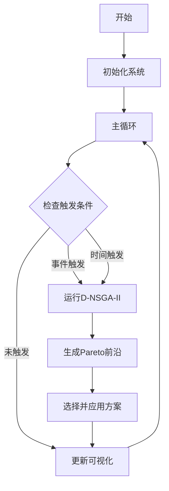

# D-NSGA-II 校园自习室动态资源分配系统

## How to Run

### Docker启动（推荐）

```bash
# 构建并启动所有服务
docker-compose up --build -d

# 查看服务状态
docker-compose ps

# 查看日志
docker-compose logs -f

# 停止服务
docker-compose down
```

启动后访问：
- 前端界面: http://localhost:8081
- 后端API: http://localhost:8682
- API文档: http://localhost:8682/docs

### 本地启动

**后端：**
```bash
cd backend
python -m venv venv
source venv/bin/activate  # Windows: venv\Scripts\activate
pip install -r requirements.txt
uvicorn app.main:app --host 0.0.0.0 --port 8682 --reload
```

**前端：**
```bash
cd frontend
npm install
npm run dev
```

## Services

| 服务 | 端口 | 说明 |
|------|------|------|
| frontend | 8081 | React前端界面 |
| backend | 8682 | FastAPI后端服务 |

### API端点

- `POST /api/auth/login` - 用户登录
- `POST /api/auth/register` - 用户注册
- `GET /api/simulation/status` - 获取系统状态
- `POST /api/simulation/start` - 启动模拟
- `POST /api/simulation/stop` - 停止模拟
- `POST /api/simulation/optimize` - 手动触发优化
- `GET /api/simulation/pareto-history` - 获取Pareto历史
- `WS /api/simulation/ws` - WebSocket实时推送

## 测试账号

| 角色 | 用户名 | 密码 |
|------|--------|------|
| 管理员 | admin | admin123 |
| 学生 | student | student123 |

## 题目内容

### 项目概述

本项目旨在设计并实现一个智能的校园自习室资源分配系统。该系统针对预约请求的动态性、多时段性以及多目标冲突的特点，采用"事件驱动的滚动时域"策略作为核心框架，并融合"动态NSGA-II（D-NSGA-II）"算法思想，以实时、高效地寻找Pareto最优的资源分配方案。

### 核心特性

1. **滚动时域策略** - 将长期动态问题分解为短期静态子问题，灵活应对不确定性
2. **事件驱动机制** - 监控高优先级请求和队列长度，主动触发优化
3. **D-NSGA-II算法** - 继承上一轮Pareto精英解，加速收敛
4. **多目标优化** - 同时优化满足率、利用率、公平性三个目标
5. **实时可视化** - WebSocket推送，Pareto前沿3D展示

### 技术架构

```
┌─────────────────────────────────────────────────────────┐
│                      Frontend                            │
│  React 18 + TypeScript + Ant Design + ECharts           │
└─────────────────────┬───────────────────────────────────┘
                      │ HTTP/WebSocket
┌─────────────────────▼───────────────────────────────────┐
│                      Backend                             │
│  FastAPI + DEAP + SQLite                                │
│  ┌─────────────┐ ┌─────────────┐ ┌─────────────┐       │
│  │  Simulator  │ │  Optimizer  │ │   API       │       │
│  │  (事件驱动) │ │  (D-NSGA-II)│ │  (REST/WS)  │       │
│  └─────────────┘ └─────────────┘ └─────────────┘       │
└─────────────────────────────────────────────────────────┘
```

### 适应值函数

系统采用三目标优化：

- **f₁: 最小化未满足请求数** - 衡量服务能力
- **f₂: 最大化座位利用率** - 衡量资源效率  
- **f₃: 最大化分配公平性** - 防止资源垄断

### 改进原理

| 改进点 | 解决的问题 | 原理依据 |
|--------|-----------|----------|
| 滚动时域 | 请求动态到达 | 模型预测控制思想 |
| 事件驱动 | 响应迟缓 | 应激性决策模式 |
| D-NSGA-II | 收敛速度慢 | 精英解继承与记忆 |
| 时段配置 | 需求周期性 | 精细化建模 |

### 系统流程



---

**开发者**: D-NSGA-II Study Room Team  
**版本**: 1.0.0
