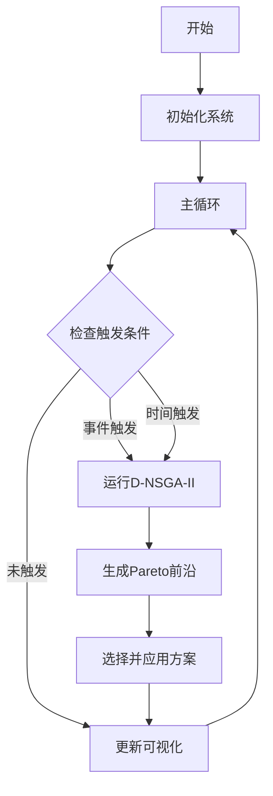

# D-NSGA-II 校园自习室动态资源分配系统

## How to Run

### Docker启动（推荐）

```bash
# 构建并启动所有服务
docker-compose up --build -d

# 查看服务状态
docker-compose ps

# 查看日志
docker-compose logs -f

# 停止服务
docker-compose down
```

启动后访问：
- 前端界面: http://localhost:8081
- 后端API: http://localhost:8682
- API文档: http://localhost:8682/docs

### 本地启动

**后端：**
```bash
cd backend
python -m venv venv
source venv/bin/activate  # Windows: venv\Scripts\activate
pip install -r requirements.txt
uvicorn app.main:app --host 0.0.0.0 --port 8682 --reload
```

**前端：**
```bash
cd frontend
npm install
npm run dev
```

## Services

| 服务 | 端口 | 说明 |
|------|------|------|
| frontend | 8081 | React前端界面 |
| backend | 8682 | FastAPI后端服务 |

### API端点

- `POST /api/auth/login` - 用户登录
- `POST /api/auth/register` - 用户注册
- `GET /api/simulation/status` - 获取系统状态
- `POST /api/simulation/start` - 启动模拟
- `POST /api/simulation/stop` - 停止模拟
- `POST /api/simulation/optimize` - 手动触发优化
- `GET /api/simulation/pareto-history` - 获取Pareto历史
- `WS /api/simulation/ws` - WebSocket实时推送

## 测试账号

| 角色 | 用户名 | 密码 |
|------|--------|------|
| 管理员 | admin | admin123 |
| 学生 | student | student123 |

## 题目内容

### 项目概述

好的，我们来将这个项目进行一次彻底的梳理。这份文档将作为您从零开始构建这个智能系统的完整蓝图和理论依据。 
项目：基于事件驱动D-NSGA-II的校园自习室动态资源分配系统 
项目概述 
本项目旨在设计并实现一个智能的校园自习室资源分配系统。该系统针对预约请求的动态性、多时段性以及多目标冲突的特点，采用“事件驱动的滚动时域”策略作为核心框架，并融合“动态NSGA-II（D-NSGA-II）”算法思想，以实时、高效地寻找Pareto最优的资源分配方案。系统最终通过丰富的可视化与交互界面，为管理员提供决策支持，为学生提供智能服务。 
1. 程序流程图 
以下是系统从启动到结束的完整逻辑流程，它清晰地展示了各个模块如何协同工作。 
graph TD 
A[开始] --> B{初始化系统}; 
B --> C[加载配置文件<br>(场景/时段/全局参数)]; 
C --> D[初始化模拟器<br>(Simulator)]; 
D --> E[初始化优化器<br>(D-NSGA-II, Pareto历史为空)]; 
E --> F{主循环: 当前时间 < 总模拟时长?}; 
F -- 是 --> G[模拟器步进<br>(时间流逝, 生成新请求)]; 
G --> H{检查触发条件}; 
H -- 事件触发<br>(高优先级/队列过长) --> I[标记: 需要优化]; 
H -- 时间触发<br>(到达滚动周期) --> I; 
H -- 未触发 --> J[更新可视化界面<br>(实时监控仪表盘)]; 
I --> K[获取当前时域内的<br>所有待处理请求]; 
K --> L[运行D-NSGA-II优化器]; 
L --> M{D-NSGA-II内部流程}; 
M --> N[动态初始化种群<br>(混合上一轮Pareto解与新解)]; 
N --> O[执行遗传算法<br>(选择/交叉/变异)]; 
O --> P[计算适应值<br>(评估每个分配方案)]; 
P --> Q[非支配排序与拥挤度计算]; 
Q --> R[生成新一代Pareto前沿]; 
R --> S[返回当前最优Pareto解集]; 
S --> T[更新Pareto历史记录<br>(用于可视化)]; 
T --> U[从Pareto前沿选择一个方案<br>(可通过人机交互选择)]; 
U --> V[执行该方案<br>(更新已确认预约状态)]; 
V --> J; 
J --> F; 
F -- 否 --> W[模拟结束]; 
W --> X[生成最终报告与<br>对比分析图表]; 
X --> Y[结束]; 
subgraph 并行/异步模块 
Z[人机交互界面<br>(管理员/学生)] 
Z -- 提交请求/调整参数 --> G 
Z -- 手动触发优化 --> I 
Z -- 选择偏好解 --> U 
end 
style J fill:#f9f,stroke:#333,stroke-width:2px 
style Z fill:#ccf,stroke:#333,stroke-width:2px 
流程解读: 
主循环是系统的核心，驱动着时间的流逝和模拟的进行。 
触发机制（事件或时间）是连接模拟和优化的桥梁，它决定了何时启动计算密集的优化过程。 
D-NSGA-II优化器是系统的“大脑”，负责在每个决策点找到最优的分配策略。 
人机交互界面与主循环并行运行，允许外部用户影响系统行为，体现了系统的开放性和可控性。 
可视化贯穿始终，将系统内部状态实时反馈给用户。 
2. 改进的原理依据 
本项目的创新性体现在对经典方法的改进上，每一项改进都针对现实世界的具体挑战。 
改进一：从静态到动态 —— 滚动时域策略 
解决的问题: 真实世界的预约请求是陆续到达的，而非一次性已知。传统的静态优化算法无法处理这种不确定性。 
原理依据: 该策略借鉴了控制理论中的模型预测控制思想。它不试图一次性解决整个时间轴上的所有问题，而是将一个长期的、复杂的动态问题，分解为一系列短期的、相对简单的静态子问题。在每个滚动周期内，系统只对未来一个“时域”进行优化，并只执行最近的决策。这使得系统能够“走一步，看一步”，灵活应对未来的不确定性，同时保持了对未来的规划能力。 
改进二：从被动到主动 —— 事件驱动机制 
解决的问题: 纯粹的时间驱动（如每30分钟优化一次）响应迟缓。可能在两次优化之间出现突发高负载（如一个班级集体预约），导致系统性能急剧下降，直到下一个优化周期才能响应。 
原理依据: 事件驱动机制赋予系统“应激性”。它模仿了人类的决策模式：当重要事件发生时，立即采取行动，而不是机械地等待。通过监控关键指标（如高优先级请求、队列长度），系统能够在负载剧增的瞬间主动触发优化，从而更快地恢复平衡，提高了系统的响应速度和鲁棒性。 
改进三：从盲目到智能 —— D-NSGA-II算法思想 
解决的问题: 在滚动时域框架下，每个子问题之间是高度相关的（例如，T时刻的请求与T+Δ时刻的请求大部分相同）。标准NSGA-II在每次优化时都从头开始，浪费了上一轮优化的宝贵信息，导致收敛速度慢。 
原理依据: D-NSGA-II的核心是“记忆”与“继承”。它认为下一个时间步的最优解，很可能就在上一个时间步最优解的附近。因此，在初始化新一轮优化的种群时，它不再是完全随机，而是用上一轮找到的Pareto精英解来“种子”一部分种群，同时补充新的随机解以探索未知区域。这使得算法能够站在“巨人的肩膀上”，更快地跟踪和捕捉到随时间变化的Pareto前沿，极大地提升了优化效率。 
改进四：从统一到周期性 —— 基于时间的参数配置 
解决的问题: 现实中的需求不是平稳的，而是呈现明显的周期性（如早晨高峰、午间低谷、晚间高峰）。使用统一的参数模型无法准确反映这种波动性，导致模拟失真。 
原理依据: 通过将一天划分为多个“时段”，并为每个时段设置不同的参数（如请求频率、预约时长），我们构建了一个更“拟真”的模拟环境。这使得系统能够在不同的压力模式下表现不同，验证了其在各种真实场景下的适应性和有效性。这体现了从“平均模型”到“精细化模型”的建模思想升华。 
3. 适应值函数 
适应值函数是遗传算法的“心脏”，它用来评价一个个体（即一个分配方案）的好坏。在本项目中，它是一个多目标函数，同时考虑多个优化维度。 
A. 个体编码 
一个个体 I 代表一个完整的分配方案。我们采用简单的二进制编码： 
I = [s₁, s₂, s₃, ..., sₙ] 
其中 n 是当前待处理的请求数量，sᵢ ∈ {0, 1}。 
sᵢ = 1 表示第 i 个请求被满足。 
sᵢ = 0 表示第 i 个请求被拒绝。 
B. 目标函数 
我们定义三个核心目标函数： 
目标一：最小化未满足请求数 (f₁) 
目的: 衡量系统的“服务能力”或“用户满意度”。未满足的请求越少越好。 
数学表达: f₁(I) = Σ (1 - sᵢ) = n - Σ sᵢ 
实现:unmet_requests = len(individual) - sum(individual) 
目标二：最大化座位利用率 (f₂) 
目的: 衡量系统的“资源效率”。座位被占用的时间越长越好。 
数学表达: f₂(I) = (Σ (T_end(i) - T_start(i)) * sᵢ) / (Total_Seats * Simulation_Duration) 
分子是所有被满足请求的总占用时长。 
分母是系统在模拟周期内的总可用座位时长。 
实现:total_occupied_time = 0 
for i, status in enumerate(individual): 
if status == 1: 
req = current_requests[i] # 需要访问请求列表 
total_occupied_time += req.end_time - req.start_time 
total_available_time = TOTAL_SEATS * SIMULATION_DURATION 
utilization_rate = total_occupied_time / total_available_time if total_available_time > 0 else 0 
目标三：最大化分配公平性 (f₃) 
目的: 防止资源总是被少数“长时段”请求者占据，保障机会均等。 
简化实现: 我们可以用“已满足请求的平均时长”的倒数来衡量。时长越短，公平性越高（因为服务了更多人）。 
数学表达: f₃(I) = 1 / ( (Σ (T_end(i) - T_start(i)) * sᵢ) / Σ sᵢ + ε ) 
ε 是一个极小值，防止分母为零。 
实现:met_requests = [i for i, status in enumerate(individual) if status == 1] 
if not met_requests: 
fairness = 0 
else: 
avg_duration = sum(current_requests[i].end_time - current_requests[i].start_time for i in met_requests) / len(met_requests) 
fairness = 1 / (avg_duration + 1e-6) # 加1e-6防止除零 
C. 约束处理 
硬约束: 同一个座位在同一时间段不能被分配给两个学生。 
处理方法 - 惩罚函数: 在评估个体时，首先检查其是否违反硬约束。如果违反，则给予一个极大的惩罚值，使其在非支配排序中被排在所有可行解之后。def has_time_conflict(individual, requests): 
# 复杂的逻辑：检查所有被满足的请求之间是否存在时间重叠 
# ... 
return conflict # True or False 
penalty = 0 
if has_time_conflict(individual, current_requests): 
penalty = 10000 # 一个足够大的惩罚值 
D. 最终适应值向量 
DEAP库默认是最小化问题。因此，对于我们要最大化的目标 f₂ 和 f₃，我们取其负数。 
最终的 evaluate 函数返回一个元组： 
evaluate(I) = (f₁(I) + penalty, -f₂(I), -f₃(I)) 
这个向量将用于NSGA-II的非支配排序，从而找到一组在“满足率”、“效率”和“公平性”之间达到最佳权衡的Pareto最优解集。

### 核心特性

1. **滚动时域策略** - 将长期动态问题分解为短期静态子问题，灵活应对不确定性
2. **事件驱动机制** - 监控高优先级请求和队列长度，主动触发优化
3. **D-NSGA-II算法** - 继承上一轮Pareto精英解，加速收敛
4. **多目标优化** - 同时优化满足率、利用率、公平性三个目标
5. **实时可视化** - WebSocket推送，Pareto前沿3D展示

### 技术架构

```
┌─────────────────────────────────────────────────────────┐
│                      Frontend                            │
│  React 18 + TypeScript + Ant Design + ECharts           │
└─────────────────────┬───────────────────────────────────┘
                      │ HTTP/WebSocket
┌─────────────────────▼───────────────────────────────────┐
│                      Backend                             │
│  FastAPI + DEAP + SQLite                                │
│  ┌─────────────┐ ┌─────────────┐ ┌─────────────┐       │
│  │  Simulator  │ │  Optimizer  │ │   API       │       │
│  │  (事件驱动) │ │  (D-NSGA-II)│ │  (REST/WS)  │       │
│  └─────────────┘ └─────────────┘ └─────────────┘       │
└─────────────────────────────────────────────────────────┘
```

### 适应值函数

系统采用三目标优化：

- **f₁: 最小化未满足请求数** - 衡量服务能力
- **f₂: 最大化座位利用率** - 衡量资源效率  
- **f₃: 最大化分配公平性** - 防止资源垄断

### 改进原理

| 改进点 | 解决的问题 | 原理依据 |
|--------|-----------|----------|
| 滚动时域 | 请求动态到达 | 模型预测控制思想 |
| 事件驱动 | 响应迟缓 | 应激性决策模式 |
| D-NSGA-II | 收敛速度慢 | 精英解继承与记忆 |
| 时段配置 | 需求周期性 | 精细化建模 |

### 系统流程



---

**开发者**: D-NSGA-II Study Room Team  
**版本**: 1.0.0
